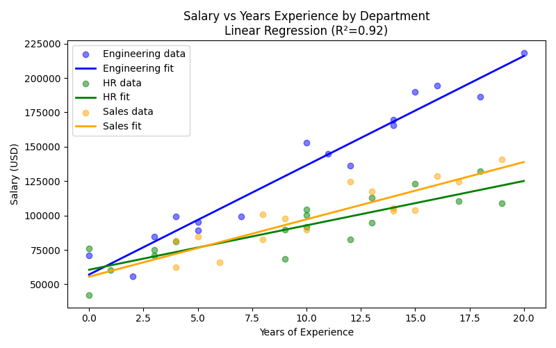
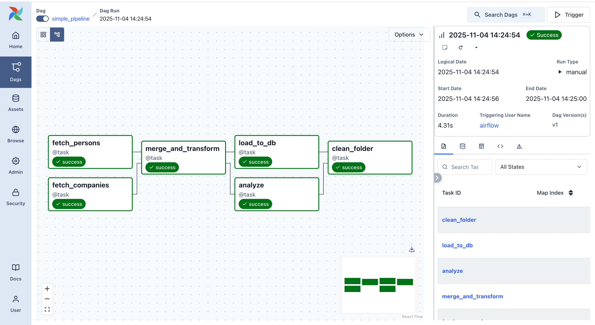

# README For IDS706 Airflow Pipeline Assignment
This pipeline generates toy data like in the class tutorial, however it is altered to create semi-random salary values based on years of experience and department. A set of companies and a set of people are generated (Data Ingestion). The company data is zipped with the individuals to create a merged employees data set (Merging). Salaries are set with a random intercept value plus a department-specific slope multiplied by years of experience (Transformation). This table is then loaded into a PostgreSQL database (DB Loading). Parallel to the database steps, the data is also analyzed using linear regression to predict salaries based on department and years of experience. Those results are plotted against a scatter plot of the data, and the plot is saved (Analysis and Visual). Finally, the pipeline removes the intermediate artifacts from the process (Cleanup).

Below are screenshots of the plot created from the pipeline, the Airflow UI showing the task pipeline and successful run, 

